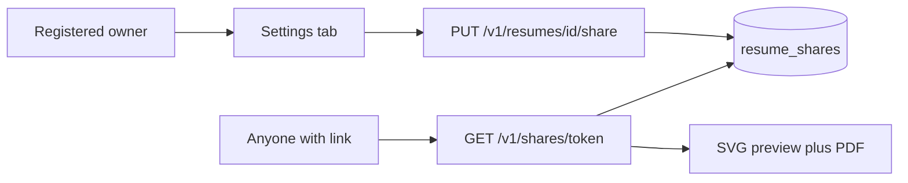

# Editor Settings and Public Share

> **For agentic workers:** REQUIRED SUB-SKILL: Use superpowers:subagent-driven-development (recommended) or superpowers:executing-plans to implement this plan task-by-task. Persist the approved design to `docs/superpowers/specs/2026-08-27-resume-settings-share-design.md` before coding. Do not commit unless the user asks.

**Goal:** Editor Settings tab for name + metadata; registered users can make a resume public (unguessable `/s/{token}` link, live preview + PDF) or private (delete the share row so old links 404).

**Architecture:** New `resume_shares` table (one active row per resume). Owner `GET/PUT /v1/resumes/{id}/share`. Anonymous `GET /v1/shares/{token}` plus `/preview` and `/export`. Public page is a read-only viewer; Typst source, chat, and ATS never leave those endpoints.

**Tech Stack:** FastAPI, SQLAlchemy 2, Alembic `005_resume_shares`, pytest, Next.js App Router, next-intl (`en` / `zh-TW` / `zh-CN`).

**Approved decisions:** live content; new token only on private→public; view + PDF download; no source; active-only row (delete on private); settings as a fourth left tab.

## Global Constraints

- Product name is Offerfy. Never CareerOS, Roleloop, Offerly, Offerloop, or RenderResume in UI copy.
- Locales: `en`, `zh-TW`, `zh-CN`. Default `zh-TW`.
- Guests can rename and see metadata; they cannot create a share. CTA: `/login?next=/editor/{id}`.
- Public APIs must not return `resume.id`, `typst_source`, chat, ATS, or owner identity.
- Repeat `PUT public=true` while already public keeps the same token. Private deletes the row. Private→public inserts a new token.
- Share pages `robots: noindex`. Unlisted: no gallery, sitemap, or Nav link.
- No share history, password, expiry, snapshot, IP rate-limit table, or admin share UI.
- Do not commit unless the user asks.
- Backend tests: `cd apps/backend && PATH="$PWD/.tools:$PATH" .venv/bin/pytest -q`
- Verify the editor settings + public link in the browser before claiming complete.

## File map

- Create: [docs/superpowers/specs/2026-08-27-resume-settings-share-design.md](docs/superpowers/specs/2026-08-27-resume-settings-share-design.md)
- Create: [docs/superpowers/plans/2026-08-27-resume-settings-share.md](docs/superpowers/plans/2026-08-27-resume-settings-share.md) (copy of this plan)
- Create: [apps/backend/alembic/versions/005_resume_shares.py](apps/backend/alembic/versions/005_resume_shares.py)
- Modify: [apps/backend/app/models.py](apps/backend/app/models.py) — `ResumeShare`, `Resume.share`
- Modify: [apps/backend/app/schemas.py](apps/backend/app/schemas.py) — `created_at` on `ResumeOut`; `ShareState`, `ShareUpdate`, `PublicShareOut`
- Modify: [apps/backend/app/routers/resumes.py](apps/backend/app/routers/resumes.py) — `_to_out` created_at; title strip/validate
- Create: [apps/backend/app/routers/shares.py](apps/backend/app/routers/shares.py)
- Modify: [apps/backend/app/main.py](apps/backend/app/main.py) — include shares router
- Modify: [apps/backend/app/routers/auth.py](apps/backend/app/routers/auth.py) — allow OAuth `next=/editor/{uuid}`
- Create: [apps/backend/tests/test_share.py](apps/backend/tests/test_share.py)
- Modify: [apps/backend/tests/test_auth.py](apps/backend/tests/test_auth.py) — editor `next` allowlist
- Modify: [apps/frontend/lib/api.ts](apps/frontend/lib/api.ts)
- Create: [apps/frontend/components/editor/EditorSettingsPanel.tsx](apps/frontend/components/editor/EditorSettingsPanel.tsx)
- Modify: [apps/frontend/components/editor/EditorShell.tsx](apps/frontend/components/editor/EditorShell.tsx) — settings tab; claim on signed-in load; title callback
- Modify: [apps/frontend/components/editor/EditorPreview.tsx](apps/frontend/components/editor/EditorPreview.tsx) — hide ATS strip when `report` is null
- Create: [apps/frontend/app/[locale]/s/[token]/page.tsx](apps/frontend/app/[locale]/s/[token]/page.tsx)
- Modify: [apps/frontend/messages/en.json](apps/frontend/messages/en.json), [zh-TW.json](apps/frontend/messages/zh-TW.json), [zh-CN.json](apps/frontend/messages/zh-CN.json)



---

### Task 1: Write the spec

Save the approved design (goal, non-goals, schema, APIs, editor tab, public page, authz, errors, tests) to `docs/superpowers/specs/2026-08-27-resume-settings-share-design.md`. Copy this plan to `docs/superpowers/plans/2026-08-27-resume-settings-share.md`. Self-review for placeholders and contradictions. Do not commit unless asked.

---

### Task 2: `resume_shares` model + migration

**Schema** (`resume_shares`):

- `id` `String(36)` PK, uuid
- `resume_id` `String(36)` FK `resumes.id` **unique**, `ondelete=CASCADE`
- `token` `String(32)` unique not null — `secrets.token_urlsafe(16)` (~22 chars)
- `created_at` timezone-aware datetime, default now

`Resume.share: ResumeShare | None` one-to-one.

Alembic `005_resume_shares`, `down_revision = "004_created_at"`. Tests use `Base.metadata.create_all`, so the model must be imported via `app.models`.

**Token helper** (in `shares.py` or a tiny `services/share.py`): generate, retry on integrity error.

---

### Task 3: Owner share API, title, `created_at`

**`ResumeOut`:** add `created_at: str` (isoformat). Update `_to_out`.

**Title:** on PUT, if `title` is set: `stripped = body.title.strip()`; empty → 400 `"Title is required"`; length > 255 → 400; else save stripped.

**Owner share** in `shares.py`:

- `GET /v1/resumes/{resume_id}/share` → `{ public: bool, token: str | null }`
- `PUT /v1/resumes/{resume_id}/share` body `{ public: bool }` → same

Both: `require_user` (no session → **401** `Sign in required`). Then `_owned_resume`. If `resume.user_id != user.id` → **403** `Sign in required to share` (covers guest-owned / unclaimed).

PUT logic:

- `public is True` and row exists → return existing token
- `public is True` and no row → insert new token, return it
- `public is False` → delete row if present, return `{ public: false, token: null }`

Frontend builds the copyable URL as `new URL("/s/" + token, window.location.origin).href` (localePrefix `as-needed`, so default zh-TW has no prefix). Backend does not bake origin.

**Tests** (`test_share.py`), TDD:

- Guest PUT share → 401
- Signed-in user, guest-owned resume (session + guest cookie, unclaimed) PUT share → 403
- User-owned: PUT public true → 200 with token; GET share matches; second PUT public true → **same** token
- PUT private → token null; GET `/v1/shares/{old}` → 404
- PUT public again → **different** token; old token still 404
- PUT title `"  New Name  "` → stored `"New Name"`; empty title → 400
- GET resume includes `created_at`

Helper: create user + session cookie like [apps/backend/tests/test_admin.py](apps/backend/tests/test_admin.py) (`SESSION_COOKIE` + `_sign`). Create a user-owned resume by POSTing `/v1/resumes` with that cookie (no guest cookie).

---

### Task 4: Public share endpoints

Still in `shares.py`, **no auth**:

- `GET /v1/shares/{token}` → `{ title, locale }` only. Missing token → **404**
- `GET /v1/shares/{token}/preview` → `PreviewPages` via existing `compile_typst_pages(source, "svg")`. Missing → 404. Compile failure → same 400/500 as owner preview
- `GET /v1/shares/{token}/export` → PDF via `compile_typst(source, "pdf")`, `Content-Disposition` filename from title (same pattern as owner export)

Loader: `db.query(ResumeShare).filter(ResumeShare.token == token).one_or_none()` then load resume; never 403 (do not leak that a token used to exist).

**Tests:** public GET meta/preview/export without cookies; private/unknown token 404; response JSON has no `typst_source` or `id`. Mock typst if existing resume tests already mock compile; otherwise follow [apps/backend/app/routers/resumes.py](apps/backend/app/routers/resumes.py) preview/export.

Register router in [apps/backend/app/main.py](apps/backend/app/main.py).

---

### Task 5: OAuth `next` for editor + claim on editor load

Replace `_safe_admin_next` with `_safe_next`:

- Reject `//`, `://`, `\`
- Allow `/admin` and `/admin/...` (existing)
- Allow `/editor/{id}` where `id` matches UUID `^[0-9a-fA-F]{8}-[0-9a-fA-F]{4}-[0-9a-fA-F]{4}-[0-9a-fA-F]{4}-[0-9a-fA-F]{12}$`

Tests in `test_auth.py`: `next=/editor/{uuid}` survives start→callback; `next=/editor/../admin` and `next=https://evil` rejected.

**EditorShell:** on mount, `getMe()`; if signed in, `claimResumes()` best-effort (same as dashboard) **before** `getResume`, so `/login?next=/editor/{id}` lands on a claimed, shareable resume.

---

### Task 6: Settings tab UI

New tab value `"settings"` in [EditorShell.tsx](apps/frontend/components/editor/EditorShell.tsx) `TabsList` after Template. Copy keys under `editor.*` in all three locale files:

- `tabSettings`
- `settingsName`, `settingsSave`, `settingsSaved`, `settingsNameError`
- `settingsCreated`, `settingsSource`, `settingsLocale`, `settingsImport`
- `settingsSourceCreate`, `settingsSourceUpload`
- `settingsImportIdle` / `pending` / `done` / `failed`
- `settingsShare`, `settingsPrivate`, `settingsPublic`, `settingsCopy`, `settingsCopied`, `settingsShareHint`
- `settingsSignIn`, `settingsSignInHint`

**`EditorSettingsPanel`:**

- Name `<input>` + Save. Calls existing `putResumeSource(id, { title })`. On success, `onTitleChange(title)` so `EditorHeader` updates.
- Metadata `<dl>`: created_at (locale-formatted datetime), source, locale, import_status. Data from `getResume` (now includes `created_at`). Pass resume fields as props from the shell after load; keep a local copy and refresh after title save.
- If `getMe()` is null: sharing card with hint + `Link` to `/login?next=/editor/{resumeId}` (`googleStartUrl` not required; login page already passes `next` into Google).
- If signed in: Private/Public control (two buttons or a switch). Public → `putResumeShare({ public: true })`, show input + Copy. Private → `putResumeShare({ public: false })`, hide URL.

**api.ts:**

```ts
export type ShareState = { public: boolean; token: string | null };
export type PublicShare = { title: string; locale: string };

export function getResumeShare(id: string): Promise<ShareState>;
export function putResumeShare(id: string, public: boolean): Promise<ShareState>;
export function getPublicShare(token: string): Promise<PublicShare>;
export function getPublicPreviewPages(token: string): Promise<string[]>;
export function exportPublicPdf(token: string): Promise<Blob>;
```

Wire `created_at` on the `Resume` type (already optional).

Keep `EditorShell` from growing: settings panel owns share fetch; shell only adds the tab, passes `resumeId` / resume metadata / `onTitleChange`, and the signed-in boolean (or let the panel call `getMe` itself).

---

### Task 7: Public page `/s/{token}`

Route: [apps/frontend/app/[locale]/s/[token]/page.tsx](apps/frontend/app/[locale]/s/[token]/page.tsx) so as-needed locale gives `/s/{token}` for zh-TW and `/en/s/{token}` for en. Copied links from settings always use origin + `/s/{token}` (no locale prefix); that still resolves via default locale.

Page:

- `metadata.robots = { index: false, follow: false }`
- Client viewer: fetch public meta + preview pages; 404 copy if `ApiError` 404
- Header: brand link home + title
- Reuse `EditorPreview` with `report={null}` (Task 6 must hide `AtsStrip` when report is null), download via `exportPublicPdf`, filename `${title || "resume"}.pdf`
- i18n namespace `share.*`: `download`, `downloading`, `preview`, `previewError`, `notFound`, `brand`

No chat, no Typst, no login wall.

---

### Task 8: Browser verification

Exercise as a real user:

1. Guest editor: Settings shows name + metadata; sharing shows sign-in CTA; rename works; header title updates.
2. Sign in (claim), Settings: set Public, copy `/s/{token}`, open that URL (or a logged-out session): preview pages + Download PDF. Confirm no Typst/chat.
3. Set Private: same URL 404s. Set Public again: new token; old URL still 404; new URL works.
4. Repeat PUT Public while already public: token unchanged.
5. Desktop and a narrow viewport for the new tab + settings form.

If anything fails, fix and re-verify.
