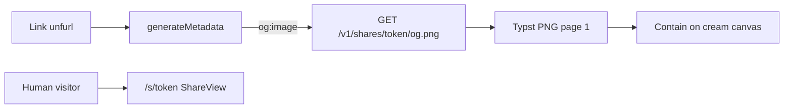

# Share OG, site OG card, and footnote Implementation Plan

> **For agentic workers:** REQUIRED SUB-SKILL: Use superpowers:subagent-driven-development (recommended) or superpowers:executing-plans to implement this plan task-by-task. Steps use checkbox (`- [ ]`) syntax for tracking.

**Goal:** Public share links unfurl with a live first-page PNG letterboxed on cream paper, generic nameless metadata, a quiet footnote CTA; every other route uses one marketing OG card.

**Architecture:** Backend `GET /v1/shares/{token}/og.png` compiles Typst page-1 PNG, Pillow-contains it onto 1200×630 `#F6F1E8`, ETag + in-process LRU. Next `opengraph-image.tsx` is card C for all locales. Share `generateMetadata` overrides `images` with the live PNG URL when the token exists. `ShareView` drops the title and adds the footnote.

**Tech Stack:** FastAPI, Typst PNG, Pillow, pytest, Next.js 16 `next/og` ImageResponse, next-intl (`en` / `zh-TW` / `zh-CN`).

## Global Constraints

- Product name is Offerfy. Never CareerOS, Roleloop, Offerly, Offerloop, or RenderResume in UI copy.
- Locales: `en`, `zh-TW`, `zh-CN`.
- Public APIs must not return `resume.id`, `typst_source`, chat, ATS, or owner identity.
- Share pages `robots: noindex, nofollow`. No resume title or username in tab, OG title, OG description, header, or footnote.
- Share OG canvas: 1200×630, background `#F6F1E8`, padding 48px, contain (never cover). Version string `og-v1-1200x630-f6f1e8-pad48`.
- Site OG image copy is English on every locale. Localized `og:title` / `og:description` still come from messages.
- Cache: ETag = sha256 of version + source; LRU max 32; `Cache-Control: public, max-age=300`. No cache table.
- Do not commit unless the user asks.
- Backend tests: `cd apps/backend && PATH="$PWD/.tools:$PATH" .venv/bin/pytest -q`
- Verify share + home OG in the browser before claiming complete.

## File map

- Spec: [docs/superpowers/specs/2026-08-28-share-og-footnote-design.md](docs/superpowers/specs/2026-08-28-share-og-footnote-design.md)
- Modify: [apps/backend/requirements.txt](apps/backend/requirements.txt) — `pillow`
- Modify: [apps/backend/app/services/typst_compile.py](apps/backend/app/services/typst_compile.py) — `fmt="png"`
- Create: [apps/backend/app/services/og_image.py](apps/backend/app/services/og_image.py) — etag, contain compose, LRU
- Modify: [apps/backend/app/routers/shares.py](apps/backend/app/routers/shares.py) — `GET .../og.png`
- Modify: [apps/backend/tests/test_preview_pages.py](apps/backend/tests/test_preview_pages.py) — PNG compile
- Create: [apps/backend/tests/test_og_image.py](apps/backend/tests/test_og_image.py) — compose + LRU + etag
- Modify: [apps/backend/tests/test_share.py](apps/backend/tests/test_share.py) — HTTP og.png
- Create: [apps/frontend/app/[locale]/opengraph-image.tsx](apps/frontend/app/[locale]/opengraph-image.tsx)
- Modify: [apps/frontend/lib/seo.ts](apps/frontend/lib/seo.ts) — `shareOgImageUrl`, `publicShareExists`
- Modify: [apps/frontend/app/[locale]/s/[token]/page.tsx](apps/frontend/app/[locale]/s/[token]/page.tsx) — `generateMetadata`
- Modify: [apps/frontend/components/share/ShareView.tsx](apps/frontend/components/share/ShareView.tsx)
- Modify: [apps/frontend/messages/en.json](apps/frontend/messages/en.json), [zh-TW.json](apps/frontend/messages/zh-TW.json), [zh-CN.json](apps/frontend/messages/zh-CN.json)



---

### Task 1: Typst `png` format

**Files:**
- Modify: `apps/backend/app/services/typst_compile.py`
- Test: `apps/backend/tests/test_preview_pages.py`

**Interfaces:**
- Consumes: existing `compile_typst_pages(source, fmt, pages=None)`
- Produces: `fmt` may be `"png"`; returns a list of PNG byte blobs; `{p}` output path; `--pages 1` still allowed to compile only page 1

- [ ] **Step 1: Write the failing tests**

Append to `apps/backend/tests/test_preview_pages.py`:

```python
def test_compile_png_pages_returns_png():
    pages = compile_typst_pages(ONE_PAGE, "png")
    assert len(pages) == 1
    assert pages[0][:8] == b"\x89PNG\r\n\x1a\n"


def test_compile_png_pages_arg_only_first_page():
    pages = compile_typst_pages(TWO_PAGE, "png", pages="1")
    assert len(pages) == 1
    assert pages[0][:8] == b"\x89PNG\r\n\x1a\n"
```

- [ ] **Step 2: Run tests to verify they fail**

Run: `cd apps/backend && PATH="$PWD/.tools:$PATH" .venv/bin/pytest tests/test_preview_pages.py::test_compile_png_pages_returns_png tests/test_preview_pages.py::test_compile_png_pages_arg_only_first_page -v`

Expected: FAIL with `400 format must be svg or pdf` (or skip if Typst CLI missing — then install is out of scope; the skip marker already requires Typst).

- [ ] **Step 3: Allow `png` in `compile_typst_pages`**

In `typst_compile.py`, change the format check and output/glob handling:

```python
if fmt not in {"svg", "pdf", "png"}:
    raise HTTPException(status_code=400, detail="format must be svg, pdf, or png")
```

Output path:

```python
if fmt == "pdf":
    out_name = "resume.pdf"
elif fmt == "png":
    out_name = "resume-{p}.png"
else:
    out_name = "resume-{p}.svg"
out_path = tmp_path / out_name
```

After a successful compile, if `fmt == "png"`:

```python
numbered = sorted(tmp_path.glob("resume-*.png"), key=_svg_page_index)
if numbered:
    return [path.read_bytes() for path in numbered]
fallback = tmp_path / "resume.png"
if fallback.is_file():
    return [fallback.read_bytes()]
raise HTTPException(status_code=500, detail="Typst produced no output")
```

Keep the existing PDF and SVG branches. `_svg_page_index` already parses `resume-N` stems; reuse it for PNG.

- [ ] **Step 4: Run tests to verify they pass**

Run: `cd apps/backend && PATH="$PWD/.tools:$PATH" .venv/bin/pytest tests/test_preview_pages.py -q`

Expected: PASS (or skip-all if no Typst; do not merge a png code path that was never executed locally when Typst is present).

- [ ] **Step 5: Commit** (only if the user asked)

---

### Task 2: Contain compose + ETag + LRU

**Files:**
- Modify: `apps/backend/requirements.txt` — add `pillow>=10.0.0`
- Create: `apps/backend/app/services/og_image.py`
- Test: `apps/backend/tests/test_og_image.py`

**Interfaces:**
- Consumes: a page PNG as `bytes`
- Produces:
  - `OG_WIDTH = 1200`, `OG_HEIGHT = 630`, `OG_PAD = 48`, `OG_BG_RGB = (0xF6, 0xF1, 0xE8)`, `OG_VERSION = "og-v1-1200x630-f6f1e8-pad48"`
  - `og_etag(source: str) -> str` (quoted sha256 hex)
  - `compose_og_png(page_png: bytes) -> bytes`
  - `og_cache_get(token: str, etag: str) -> bytes | None`
  - `og_cache_put(token: str, etag: str, body: bytes) -> None`
  - `og_cache_clear() -> None` (tests)
  - `OG_CACHE_MAX = 32`

- [ ] **Step 1: Install Pillow and write failing tests**

Add `pillow>=10.0.0` to `apps/backend/requirements.txt`. Install: `cd apps/backend && .venv/bin/pip install 'pillow>=10.0.0'`

Create `apps/backend/tests/test_og_image.py`:

```python
from io import BytesIO

from PIL import Image

from app.services.og_image import (
    OG_BG_RGB,
    OG_CACHE_MAX,
    OG_HEIGHT,
    OG_WIDTH,
    compose_og_png,
    og_cache_clear,
    og_cache_get,
    og_cache_put,
    og_etag,
)


def _solid_png(w: int, h: int, color: tuple[int, int, int]) -> bytes:
    img = Image.new("RGB", (w, h), color)
    buf = BytesIO()
    img.save(buf, format="PNG")
    return buf.getvalue()


def test_og_etag_changes_with_source():
    a = og_etag("#let x = 1")
    b = og_etag("#let x = 2")
    assert a.startswith('"') and a.endswith('"')
    assert a != b
    assert og_etag("#let x = 1") == a


def test_compose_og_png_is_1200x630_cream_letterbox():
    page = _solid_png(200, 400, (0, 0, 255))
    composed = compose_og_png(page)
    assert composed[:8] == b"\x89PNG\r\n\x1a\n"
    img = Image.open(BytesIO(composed)).convert("RGB")
    assert img.size == (OG_WIDTH, OG_HEIGHT)
    assert img.getpixel((0, 0)) == OG_BG_RGB
    assert img.getpixel((OG_WIDTH - 1, OG_HEIGHT - 1)) == OG_BG_RGB
    cx, cy = OG_WIDTH // 2, OG_HEIGHT // 2
    assert img.getpixel((cx, cy)) == (0, 0, 255)


def test_og_cache_lru_evicts_oldest():
    og_cache_clear()
    etag = og_etag("x")
    for i in range(OG_CACHE_MAX + 1):
        og_cache_put(f"tok-{i}", etag, f"body-{i}".encode())
    assert og_cache_get("tok-0", etag) is None
    assert og_cache_get(f"tok-{OG_CACHE_MAX}", etag) == f"body-{OG_CACHE_MAX}".encode()
```

- [ ] **Step 2: Run tests to verify they fail**

Run: `cd apps/backend && .venv/bin/pytest tests/test_og_image.py -v`

Expected: FAIL import error `app.services.og_image`

- [ ] **Step 3: Implement `og_image.py`**

```python
from __future__ import annotations

import hashlib
from collections import OrderedDict
from io import BytesIO
from threading import Lock

from PIL import Image

OG_WIDTH = 1200
OG_HEIGHT = 630
OG_PAD = 48
OG_BG_RGB = (0xF6, 0xF1, 0xE8)
OG_VERSION = "og-v1-1200x630-f6f1e8-pad48"
OG_CACHE_MAX = 32

_cache: OrderedDict[tuple[str, str], bytes] = OrderedDict()
_lock = Lock()


def og_etag(source: str) -> str:
    digest = hashlib.sha256(f"{OG_VERSION}\n{source}".encode()).hexdigest()
    return f'"{digest}"'


def compose_og_png(page_png: bytes) -> bytes:
    page = Image.open(BytesIO(page_png)).convert("RGBA")
    canvas = Image.new("RGB", (OG_WIDTH, OG_HEIGHT), OG_BG_RGB)
    inner_w = OG_WIDTH - 2 * OG_PAD
    inner_h = OG_HEIGHT - 2 * OG_PAD
    scale = min(inner_w / page.width, inner_h / page.height)
    new_w = max(1, round(page.width * scale))
    new_h = max(1, round(page.height * scale))
    fitted = page.resize((new_w, new_h), Image.Resampling.LANCZOS)
    rgb = Image.new("RGB", fitted.size, OG_BG_RGB)
    rgb.paste(fitted, mask=fitted.split()[3])
    x = (OG_WIDTH - rgb.width) // 2
    y = (OG_HEIGHT - rgb.height) // 2
    canvas.paste(rgb, (x, y))
    out = BytesIO()
    canvas.save(out, format="PNG")
    return out.getvalue()


def og_cache_get(token: str, etag: str) -> bytes | None:
    key = (token, etag)
    with _lock:
        val = _cache.get(key)
        if val is not None:
            _cache.move_to_end(key)
        return val


def og_cache_put(token: str, etag: str, body: bytes) -> None:
    key = (token, etag)
    with _lock:
        _cache[key] = body
        _cache.move_to_end(key)
        while len(_cache) > OG_CACHE_MAX:
            _cache.popitem(last=False)


def og_cache_clear() -> None:
    with _lock:
        _cache.clear()
```

- [ ] **Step 4: Run tests to verify they pass**

Run: `cd apps/backend && .venv/bin/pytest tests/test_og_image.py -q`

Expected: PASS

- [ ] **Step 5: Commit** (only if the user asked)

---

### Task 3: `GET /v1/shares/{token}/og.png`

**Files:**
- Modify: `apps/backend/app/routers/shares.py`
- Modify: `apps/backend/tests/test_share.py`

**Interfaces:**
- Consumes: `_resume_for_token`, `compile_typst_pages(..., "png", pages="1")`, `og_etag`, `compose_og_png`, `og_cache_get`, `og_cache_put`
- Produces: anonymous PNG response; 404 missing token; 304 on matching `If-None-Match`

- [ ] **Step 1: Write the failing HTTP tests**

Append to `apps/backend/tests/test_share.py` (reuse `_make_user` / `_session_cookie`). At the top of each og test, `og_cache_clear()`.

```python
from io import BytesIO

from PIL import Image

from app.services.og_image import OG_HEIGHT, OG_WIDTH, og_cache_clear


def _tiny_png() -> bytes:
    buf = BytesIO()
    Image.new("RGB", (40, 80), (10, 20, 30)).save(buf, format="PNG")
    return buf.getvalue()


def test_public_og_png_anonymous(client, db_session, monkeypatch):
    og_cache_clear()
    monkeypatch.setattr(
        "app.routers.shares.compile_typst_pages",
        lambda source, fmt, pages=None: [_tiny_png()],
    )
    user = _make_user(db_session, sub="sub-og", email="og@example.com")
    cookies = _session_cookie(user)
    created = client.post(
        "/v1/resumes",
        json={"locale": "en", "title": "Secret Title"},
        cookies=cookies,
    ).json()
    token = client.put(
        f"/v1/resumes/{created['id']}/share",
        json={"public": True},
        cookies=cookies,
    ).json()["token"]

    anon = TestClient(app)
    response = anon.get(f"/v1/shares/{token}/og.png")
    assert response.status_code == 200
    assert response.headers["content-type"].startswith("image/png")
    assert response.content[:8] == b"\x89PNG\r\n\x1a\n"
    img = Image.open(BytesIO(response.content))
    assert img.size == (OG_WIDTH, OG_HEIGHT)
    etag = response.headers["etag"]
    assert etag
    assert "max-age=300" in response.headers.get("cache-control", "")

    again = anon.get(f"/v1/shares/{token}/og.png", headers={"If-None-Match": etag})
    assert again.status_code == 304

    assert anon.get("/v1/shares/not-a-real-token/og.png").status_code == 404


def test_public_og_png_404_after_private(client, db_session, monkeypatch):
    og_cache_clear()
    monkeypatch.setattr(
        "app.routers.shares.compile_typst_pages",
        lambda source, fmt, pages=None: [_tiny_png()],
    )
    user = _make_user(db_session, sub="sub-og-priv", email="ogp@example.com")
    cookies = _session_cookie(user)
    created = client.post(
        "/v1/resumes", json={"locale": "en", "title": "T"}, cookies=cookies
    ).json()
    token = client.put(
        f"/v1/resumes/{created['id']}/share",
        json={"public": True},
        cookies=cookies,
    ).json()["token"]
    client.put(
        f"/v1/resumes/{created['id']}/share",
        json={"public": False},
        cookies=cookies,
    )
    anon = TestClient(app)
    assert anon.get(f"/v1/shares/{token}/og.png").status_code == 404


def test_public_og_etag_changes_when_source_changes(client, db_session, monkeypatch):
    og_cache_clear()
    monkeypatch.setattr(
        "app.routers.shares.compile_typst_pages",
        lambda source, fmt, pages=None: [_tiny_png()],
    )
    user = _make_user(db_session, sub="sub-og-src", email="ogs@example.com")
    cookies = _session_cookie(user)
    created = client.post(
        "/v1/resumes", json={"locale": "en", "title": "T"}, cookies=cookies
    ).json()
    resume_id = created["id"]
    token = client.put(
        f"/v1/resumes/{resume_id}/share",
        json={"public": True},
        cookies=cookies,
    ).json()["token"]
    anon = TestClient(app)
    first = anon.get(f"/v1/shares/{token}/og.png").headers["etag"]
    client.put(
        f"/v1/resumes/{resume_id}",
        json={"typst_source": created["typst_source"] + "\n// changed\n"},
        cookies=cookies,
    )
    second = anon.get(f"/v1/shares/{token}/og.png").headers["etag"]
    assert first != second
```

- [ ] **Step 2: Run tests to verify they fail**

Run: `cd apps/backend && PATH="$PWD/.tools:$PATH" .venv/bin/pytest tests/test_share.py::test_public_og_png_anonymous -v`

Expected: FAIL 404 (route missing)

- [ ] **Step 3: Implement the route**

In `shares.py` import `Request` (already imported), `compose_og_png`, `og_cache_get`, `og_cache_put`, `og_etag`.

```python
def _png_response(body: bytes, etag: str) -> RawResponse:
    return RawResponse(
        content=body,
        media_type="image/png",
        headers={
            "ETag": etag,
            "Cache-Control": "public, max-age=300",
        },
    )


@router.get("/v1/shares/{token}/og.png")
def public_og(token: str, request: Request, db: Session = Depends(get_db)):
    resume = _resume_for_token(token, db)
    etag = og_etag(resume.typst_source)
    if request.headers.get("if-none-match") == etag:
        return RawResponse(status_code=304, headers={"ETag": etag})
    cached = og_cache_get(token, etag)
    if cached is not None:
        return _png_response(cached, etag)
    pages = compile_typst_pages(resume.typst_source, "png", pages="1")
    body = compose_og_png(pages[0])
    og_cache_put(token, etag, body)
    return _png_response(body, etag)
```

Call `compile_typst_pages(..., pages="1")` so only page 1 is built. Do not use `--pages 1` as a substitute for `{p}` in the Typst output path (Task 1 already uses `{p}` for PNG).

- [ ] **Step 4: Run share tests**

Run: `cd apps/backend && PATH="$PWD/.tools:$PATH" .venv/bin/pytest tests/test_share.py tests/test_og_image.py -q`

Expected: PASS. Existing `test_public_share_meta_preview_export` still asserts JSON `== {title, locale}` with no extra keys.

- [ ] **Step 5: Commit** (only if the user asked)

---

### Task 4: Site marketing `opengraph-image` (card C)

**Files:**
- Create: `apps/frontend/app/[locale]/opengraph-image.tsx`

**Interfaces:**
- Consumes: Next 16 `next/og` `ImageResponse`
- Produces: 1200×630 PNG at `/[locale]/opengraph-image` for every locale; English headline/sub; cream `#F6F1E8`, clay `#A35C3A` 8px square, ink `#1C1914`, muted `#5C564E`

- [ ] **Step 1: Add the image route**

There is no frontend test runner. Implement the file:

```tsx
import { ImageResponse } from "next/og";

export const alt = "Offerfy";
export const size = { width: 1200, height: 630 };
export const contentType = "image/png";

export default function OpenGraphImage() {
  return new ImageResponse(
    (
      <div
        style={{
          width: "100%",
          height: "100%",
          display: "flex",
          flexDirection: "column",
          justifyContent: "center",
          padding: "72px 80px",
          background: "#F6F1E8",
          color: "#1C1914",
        }}
      >
        <div
          style={{
            width: 8,
            height: 8,
            background: "#A35C3A",
            marginBottom: 20,
          }}
        />
        <div
          style={{
            fontSize: 56,
            lineHeight: 1.15,
            letterSpacing: "-0.02em",
            fontWeight: 600,
            maxWidth: 900,
          }}
        >
          The AI resume editor you’ll keep using.
        </div>
        <div style={{ marginTop: 20, fontSize: 28, color: "#5C564E" }}>
          Chat edits this file. No account needed.
        </div>
      </div>
    ),
    { ...size },
  );
}
```

Use a curly apostrophe in “you’ll” to match `messages/en.json` `landing.hero.headline` / `meta.description`. Image copy stays English for `zh-TW` and `zh-CN` (no CJK font in the OG renderer). Do not add a second `opengraph-image.tsx` under `s/[token]/`.

Do not duplicate `openGraph.images` in `pageMetadata` — the file convention is enough for non-share routes. Keep `twitter.card: "summary_large_image"` in `pageMetadata`.

- [ ] **Step 2: Typecheck / lint the new file**

Run: `cd apps/frontend && npx tsc --noEmit`

Expected: no errors from this file.

- [ ] **Step 3: Commit** (only if the user asked)

---

### Task 5: Share `generateMetadata`

**Files:**
- Modify: `apps/frontend/lib/seo.ts`
- Modify: `apps/frontend/app/[locale]/s/[token]/page.tsx`
- Modify: `apps/frontend/messages/en.json`, `zh-TW.json`, `zh-CN.json` (meta keys used here; footnote keys can land in the same edit as Task 6 if you prefer one messages diff — include `metaTitle` and `metaDescription` in this task)

**Interfaces:**
- Consumes: `SITE_URL`, `BACKEND_INTERNAL_URL`, `getTranslations` `share` namespace
- Produces: `shareOgImageUrl(token)`, `publicShareExists(token)`; share metadata with generic title/description; `images` only when the token exists

- [ ] **Step 1: Messages**

`share` namespace, add:

en:

```json
"metaTitle": "Resume · Offerfy",
"metaDescription": "This resume was made and shared on Offerfy.",
"cta": "Create yours"
```

zh-TW:

```json
"metaTitle": "履歷 · Offerfy",
"metaDescription": "這份履歷在 Offerfy 製作並分享。",
"cta": "建立你的"
```

zh-CN:

```json
"metaTitle": "简历 · Offerfy",
"metaDescription": "这份简历在 Offerfy 制作并分享。",
"cta": "创建你的"
```

Keep existing `brand`, `download`, `downloading`, `preview`, `previewError`, `notFound`.

- [ ] **Step 2: SEO helpers**

Append to `lib/seo.ts`:

```ts
export function shareOgImageUrl(token: string): string {
  return `${SITE_URL}/api/v1/shares/${encodeURIComponent(token)}/og.png`;
}

export async function publicShareExists(token: string): Promise<boolean> {
  const base = process.env.BACKEND_INTERNAL_URL || "http://backend:8000";
  try {
    const res = await fetch(`${base}/v1/shares/${encodeURIComponent(token)}`, {
      cache: "no-store",
    });
    return res.ok;
  } catch {
    return false;
  }
}
```

- [ ] **Step 3: Replace static `metadata` on the share page**

`apps/frontend/app/[locale]/s/[token]/page.tsx`:

```tsx
import ShareView from "@/components/share/ShareView";
import type { Metadata } from "next";
import { getTranslations, setRequestLocale } from "next-intl/server";
import { resolveLocale } from "@/lib/locale";
import { publicShareExists, shareOgImageUrl, SITE_NAME } from "@/lib/seo";

type Props = {
  params: Promise<{ locale: string; token: string }>;
};

export async function generateMetadata({ params }: Props): Promise<Metadata> {
  const { locale: localeParam, token } = await params;
  const locale = resolveLocale(localeParam);
  const t = await getTranslations({ locale, namespace: "share" });
  const title = t("metaTitle");
  const description = t("metaDescription");
  const exists = await publicShareExists(token);
  const image = exists
    ? [{ url: shareOgImageUrl(token), width: 1200, height: 630, alt: SITE_NAME }]
    : undefined;
  return {
    title,
    description,
    robots: { index: false, follow: false },
    openGraph: {
      title,
      description,
      siteName: SITE_NAME,
      images: image,
    },
    twitter: {
      card: "summary_large_image",
      title,
      description,
      images: image?.map((item) => item.url),
    },
  };
}

export default async function SharePage({ params }: Props) {
  const { locale: localeParam, token } = await params;
  const locale = resolveLocale(localeParam);
  setRequestLocale(locale);
  return <ShareView token={token} />;
}
```

Never pass `resume.title` into metadata. `publicShareExists` hits the backend directly (`/v1/shares/...`), not `SITE_URL`.

- [ ] **Step 4: Commit** (only if the user asked)

---

### Task 6: Share page footnote + hide title

**Files:**
- Modify: `apps/frontend/components/share/ShareView.tsx`

**Interfaces:**
- Consumes: `share.metaDescription`, `share.cta`; `Link` to `/create`
- Produces: header without title; footnote on the success layout only; 404 unchanged; PDF download still uses fetched `title` as filename

- [ ] **Step 1: Update `ShareView`**

Remove the title `<span>` from the header.

Keep `h-screen flex-col overflow-hidden`. Preview wrapper stays `min-h-0 flex-1`. Add a footnote under the preview:

```tsx
<p className="shrink-0 border-t border-border px-4 py-3 text-center text-sm text-muted-foreground">
  {t("metaDescription")}{" "}
  <Link href="/create" className="font-medium text-foreground underline underline-offset-2">
    {t("cta")}
  </Link>
</p>
```

404 branch: do not render the footnote. Brand header + `t("notFound")` only.

`title` state remains for `anchor.download = `${title || "resume"}.pdf``.

- [ ] **Step 2: Lint**

Run: `cd apps/frontend && npx eslint components/share/ShareView.tsx app/[locale]/s/[token]/page.tsx lib/seo.ts app/[locale]/opengraph-image.tsx`

Expected: clean.

- [ ] **Step 3: Commit** (only if the user asked)

---

### Task 7: Verify in the browser

**Files:** none new

- [ ] **Step 1: Backend tests green**

Run: `cd apps/backend && PATH="$PWD/.tools:$PATH" .venv/bin/pytest tests/test_share.py tests/test_og_image.py tests/test_preview_pages.py -q`

Expected: PASS (preview PNG tests skip if Typst missing).

- [ ] **Step 2: Human share page**

Sign in, set a resume public, open `/[locale]/s/{token}` as a logged-out window.

- Header shows Offerfy only — no resume title
- Preview + Download PDF still work
- Footnote: attribution + Create yours → `/create`
- 404 token: old copy, no footnote

- [ ] **Step 3: Metadata and images**

View-source on the share URL:

- `<title>` is `Resume · Offerfy` (or 履歷 / 简历), not the document name
- `og:image` is `https://offerfy.cc/api/v1/shares/{token}/og.png` (or the current origin’s `/api/v1/shares/...` if `metadataBase` applies)

Open `/api/v1/shares/{token}/og.png`: 1200×630, cream letterbox, whole first page visible (not cropped).

View-source on `/` (home): `og:image` is the locale `opengraph-image` (headline card), not a resume page.

- [ ] **Step 4: Commit** (only if the user asked)
