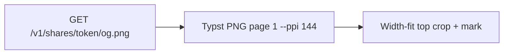

# Share OG top-half close-up Implementation Plan

> **For agentic workers:** REQUIRED SUB-SKILL: Use superpowers:subagent-driven-development (recommended) or superpowers:executing-plans to implement this plan task-by-task. Steps use checkbox (`- [ ]`) syntax for tracking.

**Goal:** Share `og.png` shows a width-fit close-up of page 1’s top on cream paper with three-side padding and an Offerfy mark in the top band.

**Architecture:** Keep `GET /v1/shares/{token}/og.png`. Change `compose_og_png` from contain/letterbox to width-fit top-align crop (pad top/left/right 48, bottom 0) and draw the mark after paste. Pass `ppi=144` only on this compile. Bump `OG_VERSION` so ETags miss.

**Tech Stack:** Pillow, Typst `--ppi`, pytest, FastAPI.

## Global Constraints

- Product name is Offerfy. Never CareerOS, Roleloop, Offerly, Offerloop, or RenderResume in UI copy.
- Canvas: 1200×630, `#F6F1E8`, pad top/left/right 48, bottom 0, inner `(48, 48)` **1104×582**.
- Version string: `og-v2-1200x630-f6f1e8-top-pad48-mark`.
- Width-fit only: `new_w = 1104`, `new_h = round(page.height * (1104 / page.width))`. Top-align. Do not contain. Do not cover-crop left/right. Do not vertically center.
- Mark: 8×8 clay `#A35C3A` at `(48, 20)` + `Offerfy` in `#1C1914` at 20px, DejaVu Sans Bold; if the font file is missing, square only. Mark bbox stays in `y ∈ [0, 48)`.
- OG compile: `compile_typst_pages(..., "png", pages="1", ppi=144)`. Preview PNG does not pass `ppi`.
- Do not change share HTML, footnote, `og:title`, card C, or `generateMetadata` image URL.
- Do not commit unless the user asks.
- Backend tests: `cd apps/backend && PATH="$PWD/.tools:$PATH" .venv/bin/pytest tests/test_og_image.py tests/test_share.py tests/test_preview_pages.py -q`

## File map

- Spec: [docs/superpowers/specs/2026-08-28-share-og-topcrop-design.md](docs/superpowers/specs/2026-08-28-share-og-topcrop-design.md)
- Modify: [apps/backend/app/services/og_image.py](apps/backend/app/services/og_image.py) — version, pad, compose, mark
- Modify: [apps/backend/tests/test_og_image.py](apps/backend/tests/test_og_image.py) — crop + clay pixel tests
- Modify: [apps/backend/app/services/typst_compile.py](apps/backend/app/services/typst_compile.py) — optional `ppi`
- Modify: [apps/backend/tests/test_preview_pages.py](apps/backend/tests/test_preview_pages.py) — ppi doubles pixel width
- Modify: [apps/backend/app/routers/shares.py](apps/backend/app/routers/shares.py) — `ppi=144`
- Modify: [apps/backend/tests/test_share.py](apps/backend/tests/test_share.py) — lambdas accept `ppi`; assert 144



---

### Task 1: Width-fit compose + Offerfy mark

**Files:**
- Modify: `apps/backend/tests/test_og_image.py`
- Modify: `apps/backend/app/services/og_image.py`

**Interfaces:**
- Consumes: existing `compose_og_png(page_png: bytes) -> bytes`, `og_etag(source: str) -> str`
- Produces: `OG_VERSION = "og-v2-1200x630-f6f1e8-top-pad48-mark"`; `OG_PAD = 48`; `OG_INNER_W = 1104`; clay square at `(48, 20)`; page pasted at `(48, 48)` width-fit

- [ ] **Step 1: Replace the contain test with top-crop + mark tests**

In `apps/backend/tests/test_og_image.py`, keep `_solid_png`, `test_og_etag_changes_with_source`, and the LRU test. Import `OG_VERSION`. Replace `test_compose_og_png_is_1200x630_cream_letterbox` with:

```python
OG_CLAY = (0xA3, 0x5C, 0x3A)


def test_og_version_is_v2_topcrop():
    assert OG_VERSION == "og-v2-1200x630-f6f1e8-top-pad48-mark"


def test_compose_og_png_width_fit_top_crop():
    page = _solid_png(200, 400, (0, 0, 255))
    composed = compose_og_png(page)
    img = Image.open(BytesIO(composed)).convert("RGB")
    assert img.size == (OG_WIDTH, OG_HEIGHT)
    assert img.getpixel((0, 0)) == OG_BG_RGB
    assert img.getpixel((OG_WIDTH - 1, 0)) == OG_BG_RGB
    assert img.getpixel((0, 47)) == OG_BG_RGB
    assert img.getpixel((0, 100)) == OG_BG_RGB
    assert img.getpixel((OG_WIDTH // 2, OG_HEIGHT - 1)) == (0, 0, 255)
    assert img.getpixel((48, 50)) == (0, 0, 255)
    assert img.getpixel((48, 20)) == OG_CLAY
    assert img.getpixel((51, 23)) == OG_CLAY


def test_compose_og_png_landscape_leaves_cream_below():
    page = _solid_png(400, 100, (0, 0, 255))
    img = Image.open(BytesIO(compose_og_png(page))).convert("RGB")
    assert img.getpixel((OG_WIDTH // 2, OG_HEIGHT - 1)) == OG_BG_RGB
```

- [ ] **Step 2: Run tests to verify they fail**

Run: `cd /home/ruby0322/offerfy/apps/backend && PATH="$PWD/.tools:$PATH" .venv/bin/pytest tests/test_og_image.py -q`

Expected: FAIL (`OG_VERSION` still `og-v1-…` and/or bottom-center still cream).

- [ ] **Step 3: Implement compose**

Replace the constants and `compose_og_png` in `apps/backend/app/services/og_image.py` (keep etag + LRU as they are). Full file:

```python
from __future__ import annotations

import hashlib
from collections import OrderedDict
from io import BytesIO
from pathlib import Path
from threading import Lock

from PIL import Image, ImageDraw, ImageFont

OG_WIDTH = 1200
OG_HEIGHT = 630
OG_PAD = 48
OG_INNER_W = OG_WIDTH - 2 * OG_PAD
OG_BG_RGB = (0xF6, 0xF1, 0xE8)
OG_CLAY_RGB = (0xA3, 0x5C, 0x3A)
OG_INK_RGB = (0x1C, 0x19, 0x14)
OG_VERSION = "og-v2-1200x630-f6f1e8-top-pad48-mark"
OG_CACHE_MAX = 32
OG_MARK_FONT = Path("/usr/share/fonts/truetype/dejavu/DejaVuSans-Bold.ttf")

_cache: OrderedDict[tuple[str, str], bytes] = OrderedDict()
_lock = Lock()


def og_etag(source: str) -> str:
    digest = hashlib.sha256(f"{OG_VERSION}\n{source}".encode()).hexdigest()
    return f'"{digest}"'


def _draw_mark(canvas: Image.Image) -> None:
    draw = ImageDraw.Draw(canvas)
    draw.rectangle((48, 20, 55, 27), fill=OG_CLAY_RGB)
    if not OG_MARK_FONT.is_file():
        return
    font = ImageFont.truetype(str(OG_MARK_FONT), 20)
    text = "Offerfy"
    left, top, right, bottom = font.getbbox(text)
    text_h = bottom - top
    text_y = int(24 - text_h / 2 - top)
    text_y = max(0, min(text_y, OG_PAD - 1 - text_h))
    draw.text((48 + 8 + 8, text_y), text, fill=OG_INK_RGB, font=font)


def compose_og_png(page_png: bytes) -> bytes:
    page = Image.open(BytesIO(page_png)).convert("RGBA")
    canvas = Image.new("RGB", (OG_WIDTH, OG_HEIGHT), OG_BG_RGB)
    scale = OG_INNER_W / page.width
    new_w = OG_INNER_W
    new_h = max(1, round(page.height * scale))
    fitted = page.resize((new_w, new_h), Image.Resampling.LANCZOS)
    rgb = Image.new("RGB", fitted.size, OG_BG_RGB)
    rgb.paste(fitted, mask=fitted.split()[3])
    canvas.paste(rgb, (OG_PAD, OG_PAD))
    _draw_mark(canvas)
    out = BytesIO()
    canvas.save(out, format="PNG")
    return out.getvalue()
```

Leave `og_cache_get` / `og_cache_put` / `og_cache_clear` unchanged below this.

- [ ] **Step 4: Run tests to verify they pass**

Run: `cd /home/ruby0322/offerfy/apps/backend && PATH="$PWD/.tools:$PATH" .venv/bin/pytest tests/test_og_image.py -q`

Expected: PASS (4 tests if etag+lru remain: version, width-fit, landscape, etag, lru → 5).

- [ ] **Step 5: Commit** (only if the user asked)

```bash
git add apps/backend/app/services/og_image.py apps/backend/tests/test_og_image.py
git commit -m "Crop share OG to the top of page 1 and mark Offerfy in the cream pad."
```

---

### Task 2: Typst `--ppi` on compile

**Files:**
- Modify: `apps/backend/app/services/typst_compile.py`
- Test: `apps/backend/tests/test_preview_pages.py`

**Interfaces:**
- Consumes: `compile_typst_pages(source: str, fmt: str, pages: str | None = None) -> list[bytes]`
- Produces: `compile_typst_pages(source: str, fmt: str, pages: str | None = None, ppi: int | None = None) -> list[bytes]`. When `ppi` is an int, the Typst argv includes `--ppi` and `str(ppi)` immediately after `--format={fmt}` (or after `--pages` — order: after `compile` flags, before the source path). Callers that omit `ppi` behave as today.

- [ ] **Step 1: Write the failing ppi test**

Append to `apps/backend/tests/test_preview_pages.py`:

```python
def test_compile_png_ppi_doubles_pixel_width():
    from io import BytesIO

    from PIL import Image

    lo = compile_typst_pages(ONE_PAGE, "png", ppi=72)
    hi = compile_typst_pages(ONE_PAGE, "png", ppi=144)
    w72 = Image.open(BytesIO(lo[0])).size[0]
    w144 = Image.open(BytesIO(hi[0])).size[0]
    assert w144 == pytest.approx(w72 * 2, rel=0.05)
```

- [ ] **Step 2: Run the new test to verify it fails**

Run: `cd /home/ruby0322/offerfy/apps/backend && PATH="$PWD/.tools:$PATH" .venv/bin/pytest tests/test_preview_pages.py::test_compile_png_ppi_doubles_pixel_width -v`

Expected: FAIL (`TypeError: ... unexpected keyword argument 'ppi'`).

- [ ] **Step 3: Add `ppi` to `compile_typst_pages`**

Change the signature to:

```python
def compile_typst_pages(
    source: str, fmt: str, pages: str | None = None, ppi: int | None = None
) -> list[bytes]:
```

After `if pages: cmd.extend(["--pages", pages])`, add:

```python
        if ppi is not None:
            cmd.extend(["--ppi", str(ppi)])
```

Do not pass `--ppi` when `ppi` is `None`.

- [ ] **Step 4: Run PNG compile tests**

Run: `cd /home/ruby0322/offerfy/apps/backend && PATH="$PWD/.tools:$PATH" .venv/bin/pytest tests/test_preview_pages.py -q`

Expected: PASS.

- [ ] **Step 5: Commit** (only if the user asked)

```bash
git add apps/backend/app/services/typst_compile.py apps/backend/tests/test_preview_pages.py
git commit -m "Let Typst PNG compile take an explicit ppi for share OG."
```

---

### Task 3: OG handler passes `ppi=144`

**Files:**
- Modify: `apps/backend/app/routers/shares.py`
- Modify: `apps/backend/tests/test_share.py`

**Interfaces:**
- Consumes: `compile_typst_pages(..., ppi: int | None = None)` from Task 2; `compose_og_png` from Task 1
- Produces: `public_og` calls `compile_typst_pages(resume.typst_source, "png", pages="1", ppi=144)`

- [ ] **Step 1: Update monkeypatches and add a ppi assertion**

In `apps/backend/tests/test_share.py`, every `compile_typst_pages` lambda must accept `ppi=None` (otherwise `ppi=144` raises `TypeError`). Change all three to:

```python
    lambda source, fmt, pages=None, ppi=None: [_tiny_png()],
```

Add:

```python
def test_public_og_compiles_with_ppi_144(client, db_session, monkeypatch):
    og_cache_clear()
    seen: dict[str, object] = {}

    def _fake(source, fmt, pages=None, ppi=None):
        seen["fmt"] = fmt
        seen["pages"] = pages
        seen["ppi"] = ppi
        return [_tiny_png()]

    monkeypatch.setattr("app.routers.shares.compile_typst_pages", _fake)
    user = _make_user(db_session, sub="sub-og-ppi", email="ogppi@example.com")
    cookies = _session_cookie(user)
    created = client.post(
        "/v1/resumes", json={"locale": "en", "title": "T"}, cookies=cookies
    ).json()
    token = client.put(
        f"/v1/resumes/{created['id']}/share",
        json={"public": True},
        cookies=cookies,
    ).json()["token"]
    TestClient(app).get(f"/v1/shares/{token}/og.png")
    assert seen == {"fmt": "png", "pages": "1", "ppi": 144}
```

- [ ] **Step 2: Run the new test to verify it fails**

Run: `cd /home/ruby0322/offerfy/apps/backend && PATH="$PWD/.tools:$PATH" .venv/bin/pytest tests/test_share.py::test_public_og_compiles_with_ppi_144 -v`

Expected: FAIL (`ppi` is `None` or missing from the call).

- [ ] **Step 3: Pass `ppi=144` in the handler**

In `apps/backend/app/routers/shares.py` `public_og`, replace the compile line with:

```python
    pages = compile_typst_pages(resume.typst_source, "png", pages="1", ppi=144)
```

- [ ] **Step 4: Run share + og tests**

Run: `cd /home/ruby0322/offerfy/apps/backend && PATH="$PWD/.tools:$PATH" .venv/bin/pytest tests/test_og_image.py tests/test_share.py tests/test_preview_pages.py -q`

Expected: PASS.

- [ ] **Step 5: Commit** (only if the user asked)

```bash
git add apps/backend/app/routers/shares.py apps/backend/tests/test_share.py
git commit -m "Compile share OG PNG at 144 ppi so the top-crop downscales."
```

---

### Task 4: Smoke a live `og.png` (no frontend)

**Files:** none (read-only verification)

**Interfaces:**
- Consumes: production or local `GET /v1/shares/{token}/og.png` after API restart
- Produces: visual confirmation only

- [ ] **Step 1: Hit a public share OG URL**

If a token exists on this host, `curl -sS -o /tmp/og.png` the PNG and open it (or `python3` Pillow: size 1200×630, `(0,0)` cream, `(48,20)` clay, bottom-center not cream). If no token, skip live fetch; unit tests in Tasks 1–3 are the gate.

- [ ] **Step 2: Do not change Next metadata or ShareView**
