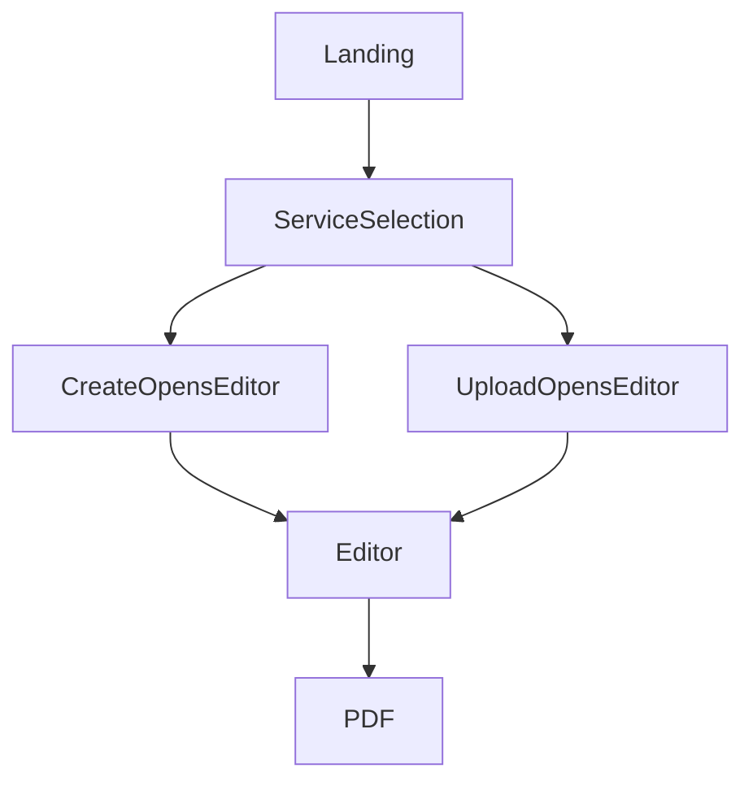
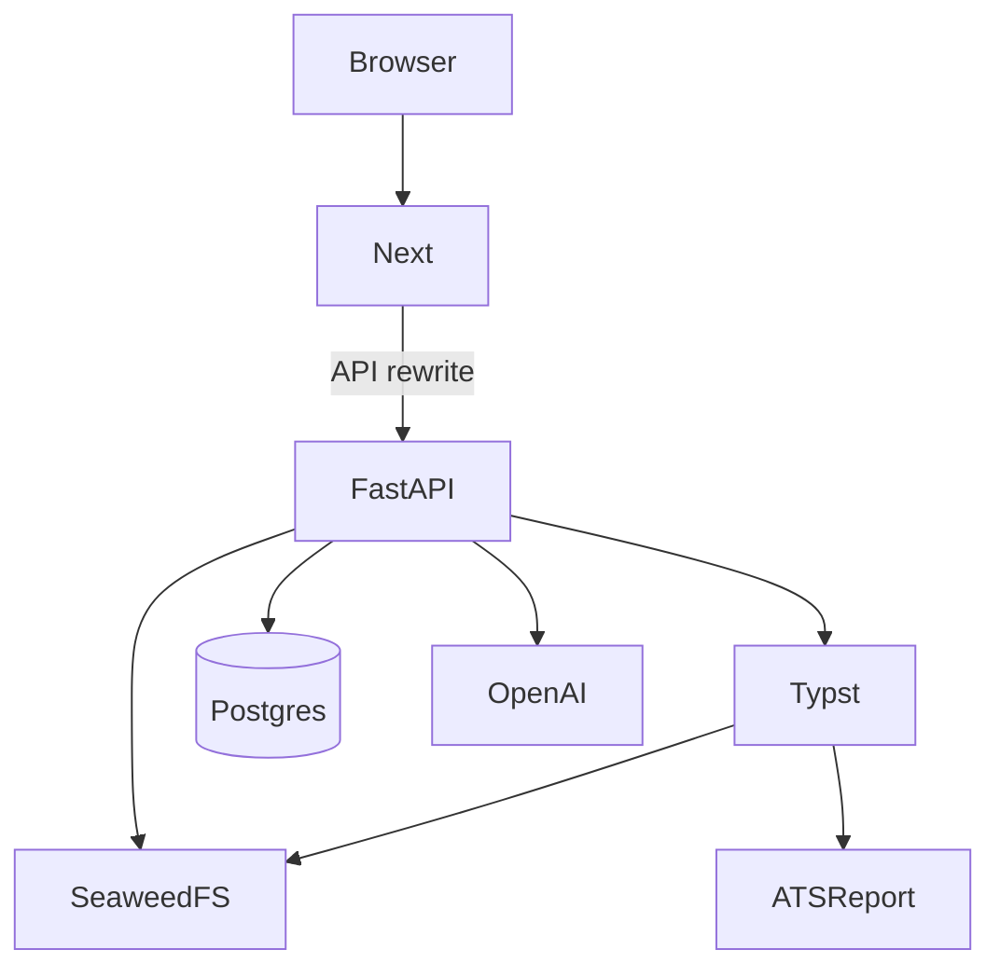

# Offerfy

> Spec for implementers. Do not invent screens, locales, templates, tools, or scores not listed here.

## Goal

Phase 1: Offerfy looks like RenderResume on marketing/auth. Users create or upload, then edit immediately. Editor: left Typst source or AI chat (one tool: edit Typst); right live preview. Primary analysis feature: ATS parseability of the compiled PDF.

## Architecture

Next is UI only. FastAPI owns guest/Google, Typst source, compile, ATS report. Chat LLM may call a single Typst-source edit tool (sync or short Argo job). Print: vendored `@preview/basic-resume:0.2.9`.

## Tech stack

Next 16.1.6 · React 19.2.3 · Tailwind 4 · Radix · next-intl · FastAPI on Python 3.12 · SQLAlchemy · Alembic · psycopg · boto3 · Typst CLI 0.15.1 · Argo Workflows · Postgres 16 · SeaweedFS 3.76 · Kustomize/Argo CD as in pd-care

## Global constraints

- Product name is Offerfy. Never CareerOS, Roleloop, Offerly, Offerloop, or RenderResume in UI copy.
- Marketing, service selection, auth, dashboard: RR look from [render-resume.com](https://render-resume.com). Do not copy RR source, prompts, six-dimension scoring, LangChain, Supabase, Puppeteer, html2canvas, jspdf, Vercel.
- **Editor is not RR smart-chat.** Left: two tabs only — Typst text editor, AI chat. Right: realtime preview. No wizards, no JSON patch UI, no forced analyze step, no extra flow chrome.
- AI is optional. Create and upload both open the editor with a starter `.typ`. No gate that requires an LLM run before editing.
- Chat tools: exactly one — edit the current Typst source (search/replace or full-document write). No other tools in Phase 1.
- Source of truth: Typst source string on the resume. Preview/export compile that source. No JSON-as-canonical-edit-model.
- Locales: `en`, `zh-TW`, `zh-CN` only. Default `zh-TW`. next-intl. Messages `apps/frontend/messages/{en,zh-TW,zh-CN}.json`. Cookie `offerfy_locale`.
- Typst CLI 0.15.1; `@preview/basic-resume:0.2.9` + `@preview/scienceicons:0.1.0` vendored. Starter document imports that package. `paper: "a4"`. `accent-color: "#f4be82"`. Fonts: New Computer Modern, Noto Serif CJK TC, Noto Serif CJK SC. Locale → font/lang as before.
- No Chromium/Playwright/WeasyPrint. No Universe/Google Fonts at runtime.
- Create: editor + starter `basic-resume` template (placeholders). Upload: `pdf png jpg jpeg webp txt md`, max 10 MiB, SeaweedFS; editor still opens immediately; file available to chat if the user asks. Non-LLM text extract from PDF/txt may prefill comments; must not block the editor.
- **ATS parseability is the Phase 1 analysis feature** (AI hiring/ATS screening). No RR grades. No hireability A–F. Job-relative match is Phase 2.
- LLM: OpenAI-compatible. `OPENAI_API_KEY` `OPENAI_BASE_URL` `OPENAI_MODEL`=`GPT-5.6 Terra`. Used only when the user chats (or optionally asks chat to import an upload).
- Anonymous: create, upload, edit, preview, ATS report, download. Google: claim, history, Phase 2+.
- Guest cookie `offerfy_guest`. Rate limit 10 chat/Typst-tool runs / hour / guest, 20 exports / hour / guest.
- Preview: SVG debounce 400ms on Typst source change. PDF on idle 2s and on download. ATS report recomputes on each successful compile.
- Next rewrite: `BACKEND_INTERNAL_URL` default `http://backend:8000`, pd-care pattern. No Grafana rewrite.
- Path `/home/ruby0322/offerfy`. Namespaces `offerfy-dev`, `offerfy-prod`.
- Phase 1 out of scope: forced AI analysis, JSON Patch editor, RR scoring/prompts, match/tailor/apply, payments, admin email, extra templates/locales, Chromium, job-performance claims.

## Flow





Chat Typst-edit may run in-process FastAPI for short patches or Argo if the job is long. Compile and ATS stay in FastAPI, not Argo.

## Phase 1 screens

Landing, service selection, create (minimal: name the resume → editor), upload dropzone then editor. **No analyze-first screen.** Editor (below). Download. Dashboard (Google). Auth. Locale switcher. ATS status on the preview pane (not a separate blocking page).

## Editor

```
+------------------+------------------+
| Tab: Typst | Chat|  Preview (right) |
|                  |  SVG/PDF live    |
| source  or  chat |  ATS strip       |
+------------------+------------------+
```

- Typst tab: plain text editor of the `.typ` source.
- Chat tab: message list + composer. Model may call **only** `apply_typst_edit` (arguments: replace range or full source). Apply updates the Typst tab and retriggers preview.
- Right: compiled preview. ATS parseability strip (pass/fail checks, not a letter grade).

## ATS parseability (`AtsReport`)

Primary Phase 1 analysis. Deterministic on compiled PDF + extracted text. Unit-tested. No LLM.

```
text_extractable          // not image-only PDF
single_column             // no multi-column/table layout traps
contact_in_body           // name+email in page body, not header/footer-only
standard_headings         // Experience/Education (or locale equivalents) as headings
dates_machine_readable    // YYYY-MM or Present patterns in text
no_embedded_images_as_text  // photos/icons not used as the only contact/name
fonts_embedded
parse_roundtrip_ok        // extract recovers author string from source if present
```

Display each as pass/fail. No weighted sum, no A–F. Copy may say the PDF is built for ATS parsers; must not say it predicts hireability.

**Validation:** ≥30 golden `.typ` fixtures (en/zh-TW/zh-CN). Compile → extract. 100% recover name/email when set in source; fixtures with known ATS traps fail the matching checks. Pytest per field.

Job-relative keyword match: Phase 2.

## Layout

```
/home/ruby0322/offerfy
  apps/frontend/     marketing RR-look; editor split
    messages/en.json zh-TW.json zh-CN.json
  apps/backend/
    app/             guest, google, typst compile, ats report, chat+apply_typst_edit
    typst/packages/  basic-resume 0.2.9, scienceicons 0.1.0
    typst/starter.typ
    fonts/
    tests/
    docs/scoring/    ATS golden fixtures + validation.md
  workflows/         optional long chat jobs only
  k8s/               pd-care copy; Argo Workflows if chat offloaded
  docker-compose.yml postgres 16, seaweedfs 3.76, backend, frontend
```

## Data stores

- `users`: google_sub, email, locale
- `guest_sessions`: key hash, locale, created_at
- `resumes`: typst_source, source create|upload, locale, guest xor user_id, claimed_at, optional upload_s3_key
- `chat_messages`: resume_id, role, content
- SeaweedFS: uploads, SVG, PDF

## FastAPI capabilities

Guest cookie. Create resume with starter Typst. Upload file, still return an editable resume. Get/put Typst source. Compile SVG/PDF. AtsReport. Chat completion with `apply_typst_edit` only. Export PDF. Google claim. Healthz/readyz. Rate limits.

## K8s

Copy pd-care `k8s/base` resources in that kustomization (frontend/backend, ingress, postgres, seaweedfs). Overlays dev/prod, argocd, cert-manager. Rename to offerfy. Drop LINE/LIFF/model-cache/Grafana.

Add Typst+fonts on backend. Argo Workflows only if chat is offloaded; compile/ATS stay on backend. No Chromium render Deployment.

## Env (names)

`DATABASE_URL` `S3_ENDPOINT` `S3_ACCESS_KEY` `S3_SECRET_KEY` `S3_BUCKET` `GOOGLE_CLIENT_ID` `GOOGLE_CLIENT_SECRET` `OPENAI_API_KEY` `OPENAI_BASE_URL` `OPENAI_MODEL` `BACKEND_INTERNAL_URL` `TYPST_PACKAGE_PATH` `TYPST_FONT_PATHS` `AUTH_TOKEN_SECRET`

## Phases

- **0** — repo, compose, k8s, starter.typ → SVG/PDF, ATS tests on fixtures
- **1** — marketing RR look, create+upload → editor, Typst|chat tabs, preview, ATS strip, Google claim
- **2** — job-relative match (Google)
- **3** — tailor + apply, human confirm
