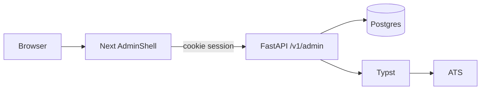

# Offerfy founder ops dashboard

**Date:** 2026-08-27
**Status:** approved in design review

## Goal

A **read-only** in-app console at `/{locale}/admin` so the operator can see users, resumes, chat volume, and system health, and **fully inspect** any resume (Typst source, chat transcript, compiled preview, ATS report). It is not a customer feature.

## Non-goals

- Writes: delete, disable, impersonate, retry import, claim/unclaim, edit Typst, change rate limits
- Token/cost LLM billing (no usage log today; v1 counts `chat_messages` and guest `rate_events`)
- Separate ops app, Grafana, or a public Nav/Footer link
- Guests list page (guests appear as resume owners)
- Payments, Search / Tailor / Apply, admin email
- Audit log
- Frontend unit tests (the frontend has no test runner today)
- Product names CareerOS, RenderResume, Roleloop, Offerly, Offerloop in UI copy

## Authz

Same Google session cookie `offerfy_session`. No new cookie.

`ADMIN_EMAILS` — comma-separated emails in env (`.env` / `.env.production`). Match `users.email` case-insensitively after trim. Empty or unset allowlist: every `/v1/admin/*` call returns **404**.

`require_admin`:

- No session → **401** (`Sign in required`)
- Session but email not in allowlist → **404** (`Not found`) — do not advertise the surface
- Allowlisted → proceed

Owner endpoints (`/v1/resumes/*`, chat) stay owner-only. Admin uses a separate loader that skips ownership. Admin compile/preview/ATS do **not** increment guest rate limits.

Unauthenticated browser on `/admin` → `/login?next=/admin`. After Google, redirect to that path.

OAuth `next`: `GET /v1/auth/google/start?next=/admin`. Pass `next` in Google `state`. Callback allows only a relative path that starts with `/admin` and contains no `//`, `://`, or `\`. Anything else → existing `/dashboard`. Default remains `/dashboard`.

Frontend: non-admin signed-in user hitting `/admin` calls `notFound()` (same 404 as unknown routes). Pages set `robots: noindex`.

## Architecture



Next is UI only. FastAPI owns allowlist check and data. Sidebar chrome is admin-only (`AdminShell`), not the customer RR `Nav`. Locale and theme switchers stay. Sidebar footer: operator email + link to `/dashboard`.

## Schema

Alembic revision after `003_user_picture`:

- `users.created_at` — timezone-aware datetime, `nullable=False`, server default now; backfill existing rows to now
- `resumes.created_at` — same

`guest_sessions.created_at` and `chat_messages.created_at` already exist. No `updated_at`. Last activity for a resume is `max(created_at, max(chat_messages.created_at))` if needed later; v1 sorts lists by `created_at` descending.

## Screens

All under `apps/frontend/app/[locale]/admin/`. Copy keys: `admin.*` in `en`, `zh-TW`, `zh-CN`.

| Path | Page |
|------|------|
| `/admin` | Overview: count cards, health row, recent 10 users, recent 10 resumes |
| `/admin/users` | Search by email substring; table |
| `/admin/users/[id]` | Identity + that user's resumes |
| `/admin/resumes` | Search title; filters `owner=user\|guest`, `source=create\|upload` |
| `/admin/resumes/[id]` | Sticky header + tabs **Source \| Chat \| Preview \| ATS** |

**Overview cards:** users, guest sessions, resumes, chat messages 24h / 7d. Health: API ok, database ok/unavailable, S3 configured yes/no. Guest rate events 24h (chat vs export) as secondary numbers, not extra cards.

**User table columns:** email, locale, resume count, created_at.

**Resume table columns:** title, owner_label, source, import_status, message_count, created_at.

**Inspect header (always visible):** title, owner_label, source, import_status, claimed_at, created_at, message_count. Link to owner user page when `owner_kind=user`.

**Tabs:**

- **Source** — read-only Typst via existing `TypstSourceEditor` with a new optional `readOnly?: boolean` (CodeMirror `EditorState.readOnly`). `onChange` unused while read-only. No save.
- **Chat** — chronological log of all roles (`user`, `assistant`, `tool`), including tool payloads.
- **Preview** — compile SVG pages on tab view; show compile errors in-tab (`typstCompileDetail`).
- **ATS** — compile PDF then existing ATS check list; same in-tab error on compile fail.

Pagination on list pages: `limit` default 50, max 100, `offset` default 0. Simple prev/next from `total`.

## HTTP API

Prefix `/v1/admin`. All require `require_admin`. JSON unless noted.

Query `q` is a case-insensitive substring. Unknown path ids → 404.

### `GET /v1/admin/overview`

```json
{
  "health": { "api": "ok", "database": "ok", "s3_configured": true },
  "counts": {
    "users": 0,
    "guest_sessions": 0,
    "resumes": 0,
    "resumes_create": 0,
    "resumes_upload": 0,
    "resumes_guest": 0,
    "resumes_user": 0,
    "chat_messages_24h": 0,
    "chat_messages_7d": 0,
    "guest_rate_chat_24h": 0,
    "guest_rate_export_24h": 0
  },
  "recent_users": [
    { "id": "", "email": "", "locale": "zh-TW", "created_at": "", "resume_count": 0 }
  ],
  "recent_resumes": [
    {
      "id": "",
      "title": "",
      "source": "create",
      "import_status": "idle",
      "owner_kind": "user",
      "owner_label": "",
      "created_at": "",
      "message_count": 0
    }
  ]
}
```

`health.database` is `"ok"` or `"unavailable"` (catch `SELECT 1` failure; still return 200 so the page can render). `health.api` is always `"ok"` if this handler ran. `s3_configured` is `Settings.s3_configured()`.

`owner_kind` is `"user"` or `"guest"`. `owner_label` is user email or `guest:` plus first 8 chars of `guest_sessions.id`.

### `GET /v1/admin/users?q=&limit=50&offset=0`

```json
{
  "items": [
    { "id": "", "email": "", "locale": "zh-TW", "picture": null, "created_at": "", "resume_count": 0 }
  ],
  "total": 0
}
```

### `GET /v1/admin/users/{id}`

```json
{
  "id": "",
  "email": "",
  "google_sub": "",
  "locale": "zh-TW",
  "picture": null,
  "created_at": "",
  "resumes": [
    {
      "id": "",
      "title": "",
      "source": "create",
      "import_status": "idle",
      "created_at": "",
      "message_count": 0
    }
  ]
}
```

### `GET /v1/admin/resumes?q=&owner=&source=&limit=50&offset=0`

`owner` optional: `user` | `guest`. `source` optional: `create` | `upload`. Invalid filter values → 422.

```json
{
  "items": [
    {
      "id": "",
      "title": "",
      "source": "create",
      "import_status": "idle",
      "locale": "zh-TW",
      "owner_kind": "user",
      "owner_id": "",
      "owner_label": "",
      "claimed_at": null,
      "created_at": "",
      "message_count": 0
    }
  ],
  "total": 0
}
```

### `GET /v1/admin/resumes/{id}`

List item fields plus `typst_source: string`.

### `GET /v1/admin/resumes/{id}/messages`

```json
{ "items": [{ "id": "", "role": "user", "content": "", "created_at": "" }] }
```

Order: `created_at` ascending. Include tool messages.

### `GET /v1/admin/resumes/{id}/preview`

Same body as product `PreviewPages`: `{ "pages": ["<svg…>", ...] }`. Same Typst compile errors as owner preview (400/500/504).

### `GET /v1/admin/resumes/{id}/ats`

Same body as product `AtsReport`: `{ "checks": [{ "name": "", "passed": true }] }`. Compile-on-read.

No admin export PDF endpoint in v1 (Preview tab is enough).

## Config and files

- Settings: `admin_emails: str = ""` → parsed list helper `admin_email_set() -> set[str]`
- [`.env.example`](.env.example): `ADMIN_EMAILS=`
- Backend: [`apps/backend/app/deps.py`](apps/backend/app/deps.py) `require_admin`; [`apps/backend/app/routers/admin.py`](apps/backend/app/routers/admin.py); [`apps/backend/app/schemas_admin.py`](apps/backend/app/schemas_admin.py); register router in [`apps/backend/app/main.py`](apps/backend/app/main.py)
- Frontend: `app/[locale]/admin/layout.tsx` (`AdminShell` + gate), page files above, [`apps/frontend/components/admin/AdminShell.tsx`](apps/frontend/components/admin/AdminShell.tsx), helpers in [`apps/frontend/lib/api.ts`](apps/frontend/lib/api.ts)
- Tests: [`apps/backend/tests/test_admin.py`](apps/backend/tests/test_admin.py)
- OAuth `next` in [`apps/backend/app/routers/auth.py`](apps/backend/app/routers/auth.py) and [`apps/frontend/app/[locale]/login/page.tsx`](apps/frontend/app/[locale]/login/page.tsx)

## Errors

| Case | Behavior |
|------|----------|
| Empty allowlist | 404 on all admin APIs; `/admin` → `notFound()` |
| Non-admin signed in | 404 API + `notFound()` page |
| Unauthenticated API | 401 |
| Unauthenticated page | redirect `/login?next=/admin` (preserve locale via next-intl) |
| Unknown user/resume id | 404 |
| Invalid list filters | 422 |
| Typst compile fail on Preview/ATS | existing compile error status; UI shows message in the tab, not a blank page |
| Database down on overview | `health.database: "unavailable"`, counts may be zero; HTTP 200 |

## Tests

pytest only. Use existing `TestClient` + cookie session helpers from [`apps/backend/tests/test_auth.py`](apps/backend/tests/test_auth.py). Set `ADMIN_EMAILS` via `monkeypatch` + `get_settings.cache_clear()`.

Must cover:

1. No cookie → 401
2. Signed-in email not in allowlist → 404
3. Empty `ADMIN_EMAILS` → 404 even for a signed-in user
4. Allowlisted email → 200 on overview
5. Admin `GET` resume + messages for a resume owned by a **different** user (and a guest-owned resume)
6. Overview `counts.users` / `resumes` match inserted rows; `chat_messages_24h` counts only recent messages
7. Owner `GET /v1/resumes/{id}` still 404 for a resume the admin does not own (admin cookie does not bypass owner routes)
8. `google/start?next=/admin` round-trip: callback with that state redirects to `/admin`; `next=https://evil.test` ignored → `/dashboard`

## Constraints (from product spec)

- Product name Offerfy. Locales `en`, `zh-TW`, `zh-CN` only. Default `zh-TW`.
- Next rewrite `/api` → FastAPI. Cookie credentials.
- Phase 1 still has no Search/Tailor/Apply backends.
- No Grafana rewrite.
