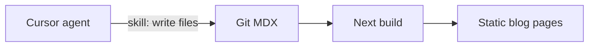

# Offerfy blog (git MDX, agent-published)

**Date:** 2026-08-28
**Status:** approved in design review

## Goal

A public `/blog` on the landing visual system that ranks and carries brand: SEO guides and product notes in one stream. Posts live as MDX in git. The operator does not write or edit posts by hand; a Cursor skill plus build-time validation is the publishing path.

## Non-goals

- Admin CMS, write APIs, or any change to the read-only `/admin` console
- Comments, search, tags, tag URLs, pagination, author pages, newsletter
- Separate `/changelog` or `/journal` (type is a label on `/blog`)
- Headless CMS, Notion, Decap, Tina
- Site-wide search `SearchAction` JSON-LD
- Claiming Search / Tailor / Apply already ship, or ATS hireability grades
- Product names CareerOS, RenderResume, Roleloop, Offerly, Offerloop in UI or posts
- Frontend unit-test runner (none exists today)
- Changing `/create`, `/upload`, `/editor`, dashboard, or auth flows beyond adding a Blog footer link on the app shell

## Operator and URL

- Brand: Offerfy at `https://offerfy.cc`
- Locales: `en`, `zh-TW`, `zh-CN`. Default `zh-TW`, `localePrefix: as-needed` (unprefixed URLs are zh-TW)
- Contact unchanged: `james@offerfy.cc`

## Architecture

Next reads the filesystem at build time. FastAPI and Postgres are not involved.



**Publish** is `draft: false` on a complete three-locale post, then commit, then deploy. **Unpublish** is `draft: true` or delete the folder.

`next dev` shows drafts (badge on index and post). `next build` / production omit drafts.

## Content model

Path (inside the frontend Docker context):

```
apps/frontend/content/blog/<slug>/
  meta.yaml
  en.mdx
  zh-TW.mdx
  zh-CN.mdx
  images/            # optional
```

`<slug>` is kebab-case ASCII, stable, no dates. It is the URL slug in every locale.

`meta.yaml` (shared; must not be duplicated in MDX):

```yaml
type: guide | note
publishedAt: 2026-08-28    # ISO date
updatedAt: 2026-08-28      # optional
draft: false
```

Each locale MDX:

```mdx
---
title: "…"          # ~50–60 characters; page H1
description: "…"    # ~140–160 characters; meta + OG
---

Body starts at ## . Do not put an extra h1 in the body.
```

A non-draft post **must** have all three locale files. Missing, empty, or invalid files fail the build.

## Routes

| Page | zh-TW | en | zh-CN |
|------|-------|----|-------|
| Index | `/blog` | `/en/blog` | `/zh-CN/blog` |
| Post | `/blog/<slug>` | `/en/blog/<slug>` | `/zh-CN/blog/<slug>` |
| RSS | `/blog/rss.xml` | `/en/blog/rss.xml` | `/zh-CN/blog/rss.xml` |

`generateStaticParams` from the content tree. Unknown slug → `notFound()`. Locale switcher uses the existing pathname replace, so it stays on the same slug.

## Chrome

Landing paper system (`landing-page`, Fraunces display, Source Sans 3, clay 6px square). Explicit `Nav variant="landing"` and `Footer variant="landing"` (same trap as legal: do not fall through to the app shell).

**Index:** quiet list, same `max-w-[72rem]` frame as landing nav/hero. Page title “Blog”. Each row: type label (`guide` | `note`) · date · title · description. Newest `publishedAt` first. Empty published set: one muted line from `blog.empty` (seed post means this is not the launch state).

**Post:** same 72rem frame; dek, MDX body, and CTA `max-w-[42rem]` (landing copy measure), left-aligned. Type · date (`updatedAt` if present, else `publishedAt`). `h1` = frontmatter `title`. Then **always** a layout `CtaRow` (Create resume / or upload one) even if the MDX also includes `CtaRow`. No TOC, no related/previous-next in v1.

**Nav**

- Landing nav: Blog link after the wordmark (not on app/editor nav).
- Footer (landing **and** app): Blog beside Terms / Privacy.

Admin stays `robots: noindex` with no Blog requirement.

## MDX

Compiler: `next-mdx-remote/rsc`. `remark-gfm` already in the app. If the package does not support Next 16 at install time, use `@mdx-js/mdx` with the same whitelist — do not add a second MDX path.

**Whitelist only** (unknown JSX fails the build):

| Component | Use |
|-----------|-----|
| `Callout` | Short aside. Prop `label` optional. |
| `CtaRow` | Create / Upload, existing `landing.hero` copy. |
| `Figure` | Local image under `images/`. Required `alt`. |

Standard markdown: `p`, `h2`–`h3`, lists, links, inline `code`, fenced code, blockquote, GFM tables. No `h1` in the body. No raw HTML. No importing other modules.

`react-markdown` in chat does not change.

## SEO

`metadataBase` is `https://offerfy.cc` (even in local/preview so the sitemap is not localhost).

**Every public marketing page** (landing, terms, privacy, blog index, post):

- Canonical via next-intl `getPathname` + `metadataBase`
- `alternates.languages` for `en`, `zh-TW`, `zh-CN`, and `x-default` → zh-TW (unprefixed)
- Open Graph + Twitter `summary_large_image`
- `og:locale` / `og:locale:alternate`

**`app/sitemap.ts`:** `/`, `/terms`, `/privacy`, `/blog`, every non-draft post. Each entry includes `lastModified` and language alternates. No admin, dashboard, editor, login, API.

**`app/robots.ts`:** allow `/`; disallow `/admin`, `/dashboard`, `/editor`, `/login`, `/api`. Point to the sitemap.

**JSON-LD** (script tags):

- Organization on landing (and reusable on legal): name Offerfy, url `https://offerfy.cc`
- `Blog` on the index
- `BlogPosting` on the post: `headline`, `datePublished`, `dateModified`, `inLanguage`, `mainEntityOfPage`, `publisher` Organization

**OG image:** `opengraph-image.tsx` on the post route via `next/og`. Paper background, clay square, type label, title. One image per locale. Agents do not add PNGs.

**RSS:** one feed per locale, items = non-draft posts in that locale, newest first.

No tag or category URLs.

Title pattern: `{title} · Offerfy`. Index uses `blog.metaTitle`.

## Agentic publishing

Cursor skill: [`.cursor/skills/publish-blog-post/SKILL.md`](../../../.cursor/skills/publish-blog-post/SKILL.md)

The skill is the operational UI. When the operator prompts “write a post about X” or “publish the ATS guide”, the agent follows it without a CMS.

Skill must include:

1. **When:** create, edit, translate, or publish a post.
2. **Voice:** indie landing, short sentences, no SaaS template tone. Product name Offerfy only. Banned names as in Global constraints.
3. **Honesty:** ATS is parseability of the compiled PDF, not hireability. Search / tailor / apply are coming, not shipped.
4. **Recipe:** create or update `apps/frontend/content/blog/<slug>/` with `meta.yaml` + three MDX files. Ask for `type` (`guide` | `note`) if missing. Default source locale `zh-TW`, then real translations (not pasted English) into `en` and `zh-CN`.
5. **SEO checklist:** title length, description length, slug quality, body starts at `h2`, whitelist components only, no keyword stuffing, no invented features.
6. **Drafts:** new posts start `draft: true` unless the operator says publish. Preview in `next dev`. Publish flips `draft: false` only when all three locales validate.
7. **Git:** write files, run `npm run blog:validate` in `apps/frontend`. Commit when the operator asks. Do not push unless asked.
8. **Images:** prefer none. `Figure` only with a local file and `alt`. OG is generated.

## Validation

`apps/frontend/lib/blog` loads and validates the tree. `package.json` script `blog:validate` runs the same checks. `next build` must fail if validation fails (import the loader from the blog routes / sitemap).

Fail the build when:

- A folder is missing `meta.yaml` or any of `en.mdx`, `zh-TW.mdx`, `zh-CN.mdx`
- `type` is not `guide` | `note`
- Dates are invalid
- Slug is not kebab-case ASCII
- `title` or `description` empty
- Body contains `h1` or raw HTML
- MDX does not compile, or uses a non-whitelist component
- `draft: false` but any locale file is missing or invalid

Draft posts may be incomplete **only** in `next dev` if we still require all three files once `draft: false`. Simpler rule used here: **all three locale files always required**, even for drafts, so the agent cannot “forget” a language.

## Seed post

Slug `editor-first`. `type: note`. `draft: false`. Honest product note: why the resume editor shipped before search/tailor/apply. All three locales. No invented metrics. Gives `/blog` a real first URL and a compile fixture.

## Copy keys

Namespace `blog` in `apps/frontend/messages/{en,zh-TW,zh-CN}.json`:

- `metaTitle`, `title`, `empty`
- `guide`, `note` (type labels)
- `updated` with `{date}`
- `navLink` / footer uses `footer.blog`

Landing hero CTA strings are reused for `CtaRow` (`landing.hero.ctaCreate`, `ctaUpload`).

## Files

Create:

- `apps/frontend/content/blog/editor-first/meta.yaml` + `en.mdx` + `zh-TW.mdx` + `zh-CN.mdx`
- `apps/frontend/lib/blog/types.ts`
- `apps/frontend/lib/blog/load.ts`
- `apps/frontend/lib/blog/validate.ts`
- `apps/frontend/lib/blog/mdx.tsx`
- `apps/frontend/lib/seo.ts` — `metadataBase`, canonical, language alternates helper
- `apps/frontend/components/blog/Callout.tsx`
- `apps/frontend/components/blog/CtaRow.tsx`
- `apps/frontend/components/blog/Figure.tsx`
- `apps/frontend/components/blog/mdx-map.ts`
- `apps/frontend/components/blog/PostIndex.tsx`
- `apps/frontend/components/blog/PostArticle.tsx`
- `apps/frontend/app/[locale]/blog/page.tsx`
- `apps/frontend/app/[locale]/blog/[slug]/page.tsx`
- `apps/frontend/app/[locale]/blog/[slug]/opengraph-image.tsx`
- `apps/frontend/app/[locale]/blog/rss.xml/route.ts`
- `apps/frontend/app/sitemap.ts`
- `apps/frontend/app/robots.ts`
- `.cursor/skills/publish-blog-post/SKILL.md`

Modify:

- `apps/frontend/app/[locale]/layout.tsx` — `metadataBase`, default OG/canonical/alternates
- `apps/frontend/app/[locale]/page.tsx`, `terms/page.tsx`, `privacy/page.tsx` — language alternates + OG
- `apps/frontend/components/Nav.tsx` — Blog link when `landing`
- `apps/frontend/components/Footer.tsx` — Blog link
- `apps/frontend/app/[locale]/globals.css` — blog article/list styles (extend legal column)
- `apps/frontend/messages/{en,zh-TW,zh-CN}.json`
- `apps/frontend/package.json` — `blog:validate` + MDX/yaml deps

## Verification

No frontend unit tests. Verify:

1. `npm run blog:validate` passes with the seed post.
2. Removing `zh-CN.mdx` from a non-draft folder makes `blog:validate` (and `next build`) fail.
3. Unknown MDX tag (e.g. `<Tweet />`) fails validation.
4. Browser: `/blog`, `/en/blog`, `/zh-CN/blog` — landing chrome, quiet list, seed note.
5. Open the seed post; locale switcher stays on the slug; CTA works; light/dark; ~375px readable.
6. Footer on `/` and `/login` includes Blog; landing nav includes Blog; editor nav does not.
7. `curl` sitemap and robots; post HTML contains canonical, hreflang, JSON-LD `BlogPosting`, and an OG image URL.
8. `/blog/rss.xml` and `/en/blog/rss.xml` list the seed post.
9. Draft: set seed `draft: true`, `next build` omits it from sitemap and index; `next dev` still shows it with a draft badge.

## Global constraints (inherited)

- Product name Offerfy. Never CareerOS, Roleloop, Offerly, Offerloop, or RenderResume in UI copy or posts.
- Locales `en`, `zh-TW`, `zh-CN` only. Default `zh-TW`.
- Landing visual system for public marketing pages (legal + blog).
- Next is UI only; this feature adds no FastAPI routes.
